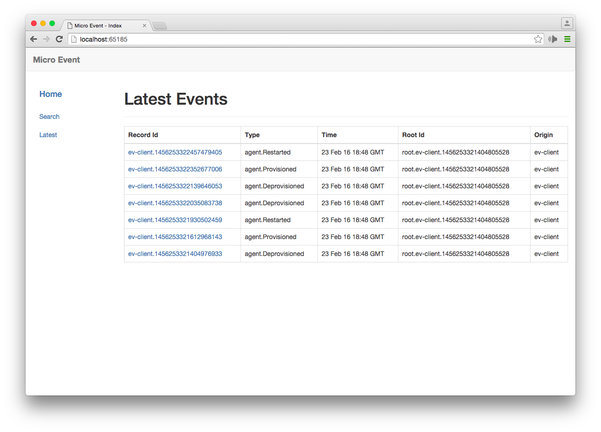
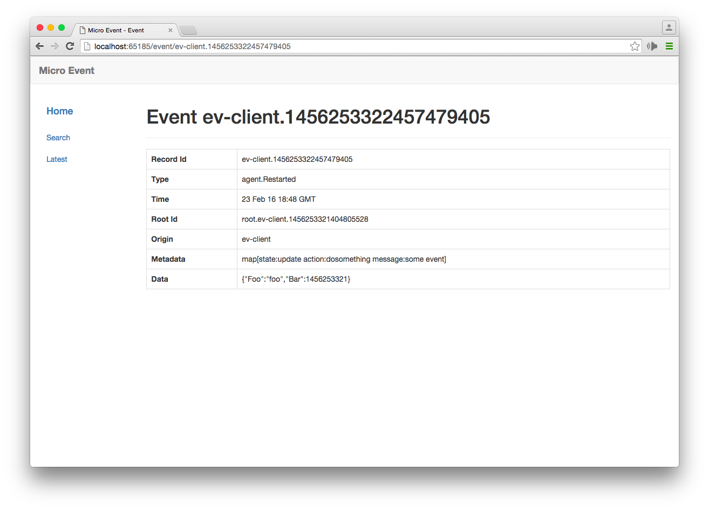
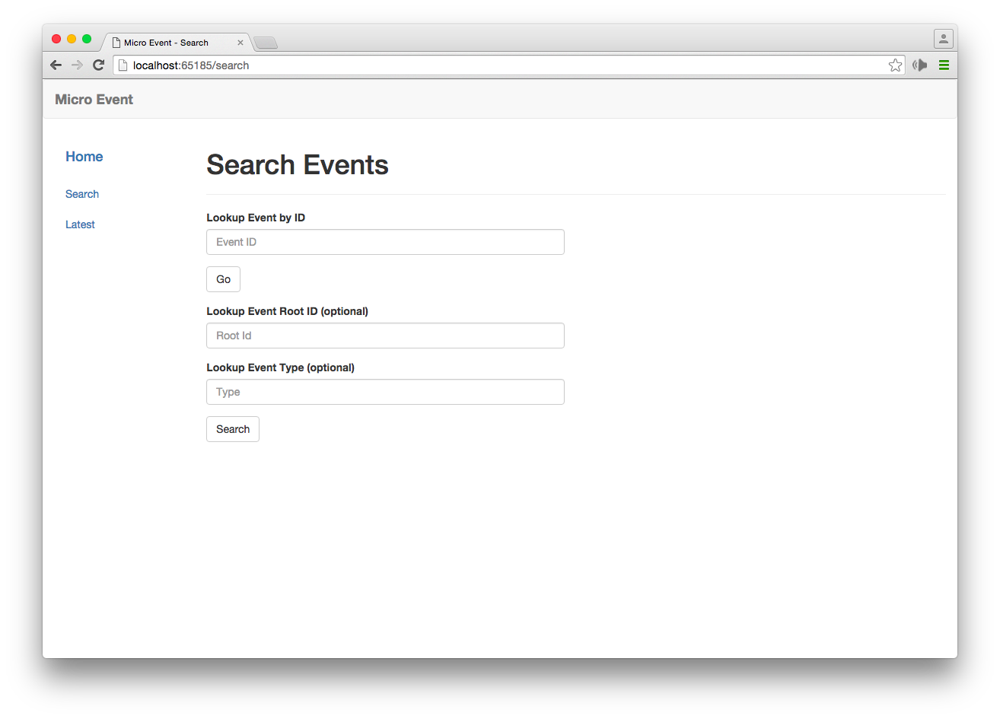

# Event Web

The event web is a dashboard for the platform event-srv. 

## Getting started

1. Install Consul

	Consul is the default registry/event for go-micro apps. It's however pluggable.
	[https://www.consul.io/intro/getting-started/install.html](https://www.consul.io/intro/getting-started/install.html)

2. Run Consul
	```
	$ consul agent -dev -advertise=127.0.0.1
	```

3. Download and start the service

	```shell
	go get github.com/micro/event-web
	event-web
	```

	OR as a docker container

	```shell
	docker run microhq/event-web --registry_address=YOUR_REGISTRY_ADDRESS
	```


-

-


